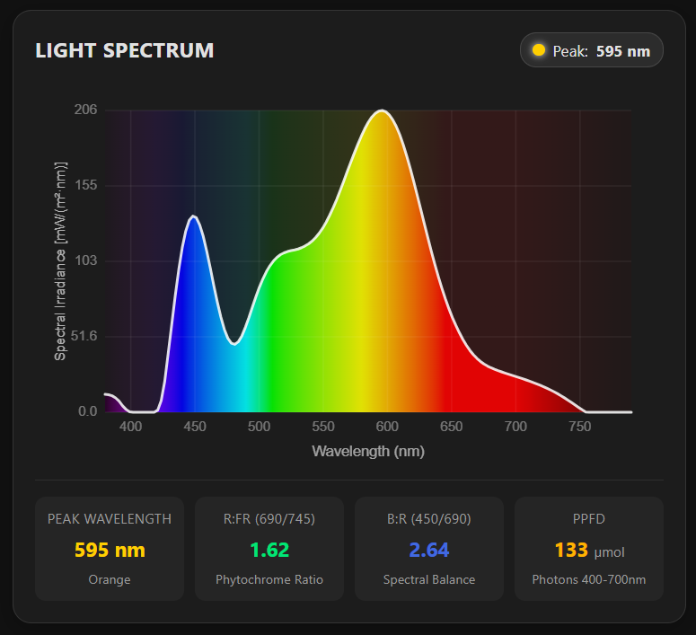

# AS7343 Light Spectrum Card for Home Assistant

[](https://github.com/hacs/default)
[](https://opensource.org/licenses/MIT)

A Home Assistant custom Lovelace card for visualizing spectral distribution and irradiance from the **ams-OSRAM AS7343 14-channel spectral sensor**.

This card performs **mathematical spectrum reconstruction** using ams-OSRAM's official 12-channel vendor basis matrix (125 spectral sample points, 380 nm to 1000 nm in 5 nm increments) and renders a smooth, high-resolution spectral curve scaled in physical **Spectral Irradiance [$\text{mW}/(\text{m}^2 \cdot \text{nm})$]**.

## Acknowledgements & Credits

This project was inspired by and builds upon the pioneering work of **[goatboynz/HA-par-spectrum-card](https://github.com/goatboynz/HA-par-spectrum-card)** and **[latonita/HA-par-spectrum-card](https://github.com/latonita/HA-par-spectrum-card)**.

- **[latonita/HA-par-spectrum-card](https://github.com/latonita/HA-par-spectrum-card)**: For pioneering the integration of ams-OSRAM mathematical basis matrix reconstruction in Home Assistant Lovelace cards.
- **[goatboynz/HA-par-spectrum-card](https://github.com/goatboynz/HA-par-spectrum-card)**: For the original spectral card concept and UI inspiration.

---



---

## Key Features

- **1:1 ams-OSRAM Mathematical Spectrum Reconstruction**: Reconstructs the continuous light spectrum from the 12 sensor channels using ams-OSRAM's vendor basis matrix (`SPECTRAL_BASIS.as7343`, 380–1000 nm at 5 nm resolution).
- **Physical Spectral Irradiance**: Scaled to absolute physical units ($\text{mW}/(\text{m}^2 \cdot \text{nm})$) via Planck-Einstein energy integration across the PAR waveband (400–700 nm), providing accurate curve heights that dynamically reflect dimming and light levels.
- **Spectrum Color Gradient**: Rich rainbow gradient fill with ambient glow matching standard CIE / visible wavelength color profiles.
- **Interactive Inspection Tooltips**: Hover or touch any point along the curve to see the exact wavelength (nm), color band, spectral irradiance ($\text{mW}/(\text{m}^2 \cdot \text{nm})$), and the nearest physical sensor channel reading in raw counts.
- **Dynamic Peak Wavelength Tracker**: Displays the dominant peak wavelength in the card header with an adaptive spectral color indicator.
- **Universal Optical Metrics**:
  - **Peak Wavelength & Band**: Identifies the primary spectral emission (e.g. 450 nm Royal Blue, 660 nm Deep Red).
  - **R:FR Ratio (690 / 745 nm)**: Calibrated Red to Far-Red ratio for phytochrome response and light quality.
  - **B:R Ratio (450 / 690 nm)**: Blue to Red balance indicator.
  - **PPFD / PAR / Lux**: Photon flux density (or Illuminance / Clear counts) when available.
- **Universal Auto-Discovery**: Automatically matches AS7343 channels from popular ESPHome configurations without manual YAML mapping.

---

## Installation

### Method 1: Via HACS (Recommended)

1. Open **HACS** in Home Assistant.
2. Click the three dots in the top right corner and select **Custom repositories**.
3. Paste this repository URL: `https://github.com/burymichu/as7343-spectrum-card`
4. Category: **Dashboard** (or **Lovelace**).
5. Click **Add**, find **AS7343 Light Spectrum Card** and click **Download**.
6. Refresh your browser (`Ctrl + F5`).

### Method 2: Manual Installation

1. Download `dist/as7343-spectrum-card.js`.
2. Copy it into your Home Assistant `<config>/www/` directory.
3. In Home Assistant, navigate to **Settings** > **Dashboards** > **Resources**.
4. Add resource:
   - URL: `/local/as7343-spectrum-card.js`
   - Resource type: `JavaScript Module`
5. Refresh your dashboard.

---

## Configuration

Add the card to your dashboard via the Lovelace UI editor or YAML:

```yaml
type: custom:as7343-spectrum-card
title: LIGHT SPECTRUM
height: 280
show_badges: true
axis: [380, 790]
```

### Options

| Name | Type | Default | Description |
| :--- | :--- | :--- | :--- |
| `type` | string | **Required** | `custom:as7343-spectrum-card` |
| `title` | string | `LIGHT SPECTRUM` | Card header title |
| `height` | number | `280` | Canvas graph height in pixels |
| `show_badges` | boolean | `true` | Show summary metric tiles (Peak, R:FR, B:R, PPFD) |
| `axis` | list | `[380, 790]` | Wavelength range for X-axis `[min, max]` (e.g. `[380, 790]` or `[380, 1000]`) |
| `entities` | object | *Auto* | Optional manual entity overrides |

---

## Sensor Auto-Discovery & Universal Compatibility

The card automatically matches entities without requiring manual configuration. It works out-of-the-box with multiple firmware implementations:

1. **[burymichu/esphome-as7343](https://github.com/burymichu/esphome-as7343)**:
   - Channels: `sensor.*as7343_f1*`, `sensor.*as7343_fz*`, `sensor.*as7343_fxl*`, etc.
   - Metrics: `sensor.*r_fr*`, `sensor.*b_r*`, `sensor.*ppfd*`, `sensor.*clear*`, `sensor.*lux*`
2. **`as734x` / `latonita` naming scheme**:
   - Nanometer channel naming: `sensor.*380nm*`, `sensor.*415nm*`, `sensor.*445nm*`, `sensor.*480nm*`, `sensor.*515nm*`, `sensor.*555nm*`, `sensor.*590nm*`, `sensor.*630nm*`, `sensor.*680nm*`, `sensor.*730nm*`, `sensor.*nir*`
3. **Generic AS7343 channel suffixes**:
   - Channels ending in `_f1`, `_f2`, `_fz`, `_f3`, `_f4`, `_fy`, `_f5`, `_fxl`, `_f6`, `_f7`, `_f8`, `_nir`, `_clear`

### Manual Entity Mapping (Optional)

If your entity IDs follow custom naming patterns, you can map them explicitly in YAML:

```yaml
type: custom:as7343-spectrum-card
title: LIGHT SPECTRUM
entities:
  f1: sensor.my_sensor_f1
  f2: sensor.my_sensor_f2
  fz: sensor.my_sensor_fz
  f3: sensor.my_sensor_f3
  f4: sensor.my_sensor_f4
  f5: sensor.my_sensor_f5
  fy: sensor.my_sensor_fy
  fxl: sensor.my_sensor_fxl
  f6: sensor.my_sensor_f6
  f7: sensor.my_sensor_f7
  f8: sensor.my_sensor_f8
  nir: sensor.my_sensor_nir
  # Optional:
  ppfd: sensor.my_sensor_ppfd
  clear: sensor.my_sensor_clear
  lux: sensor.my_sensor_lux
```

## License

MIT License - see the [LICENSE](LICENSE) file for details.
